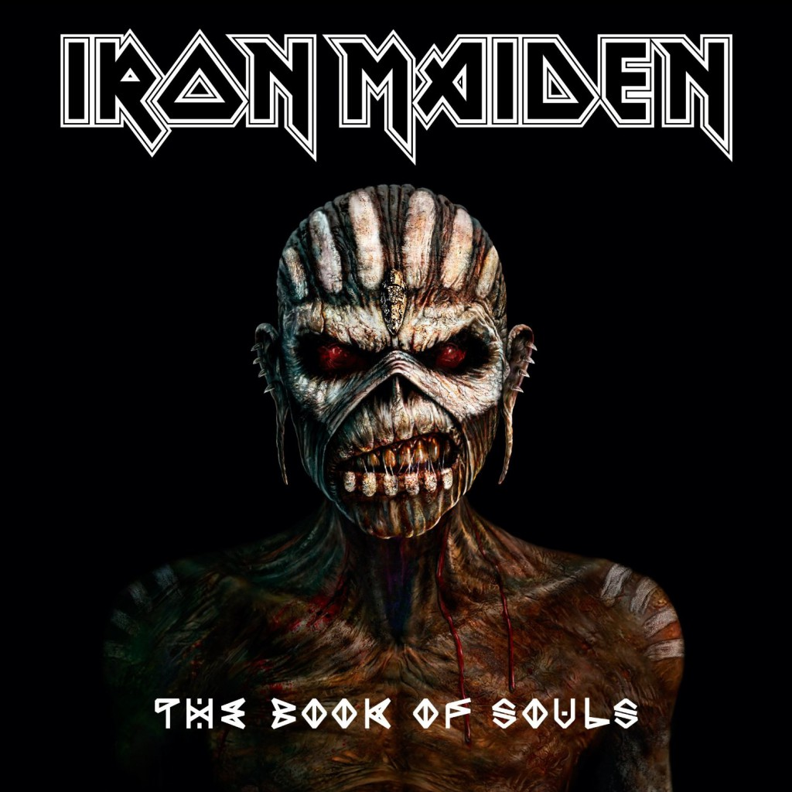

<figure>
  
  <figcaption></figcaastption>
</figure>

My guess is that it will not be until the next major version of Windows that they are able to completely and confidently embrace this new direction. Until then, Windows 8 is likely to be a transitional OS that, by taking users to alien and often uncomfortable territories, serves to (perhaps too) gently push users towards Microsoft’s vision of the future of personal computing.

## Empire of the Clouds

My guess is that it will not be until the next major version of Windows that they are able to completely and confidently embrace this new direction. Until then, Windows 8 is likely to be a transitional OS that, by taking users to alien and often uncomfortable territories, serves to (perhaps too) gently push users towards Microsoft’s vision of the future of personal computing.
